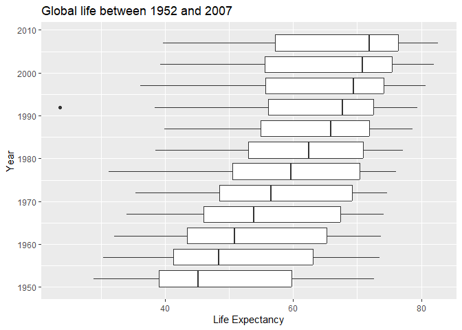
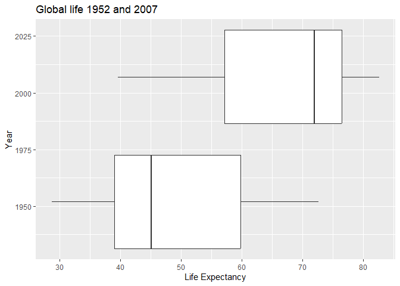
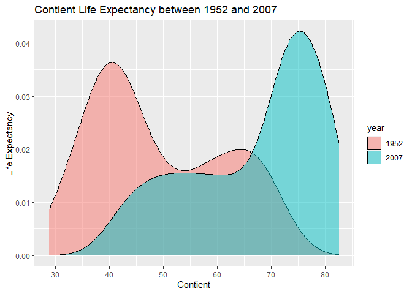
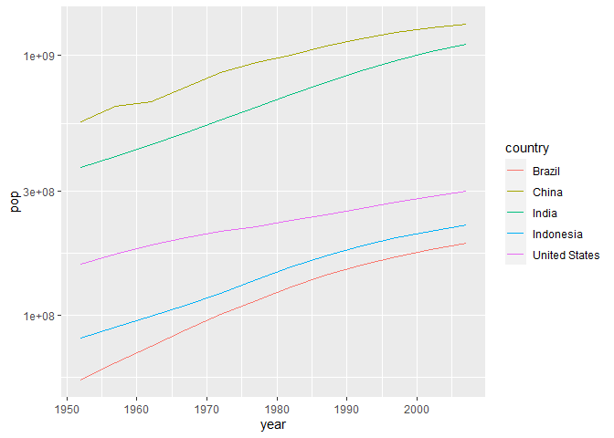
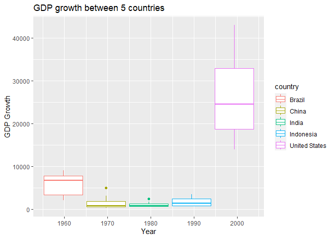
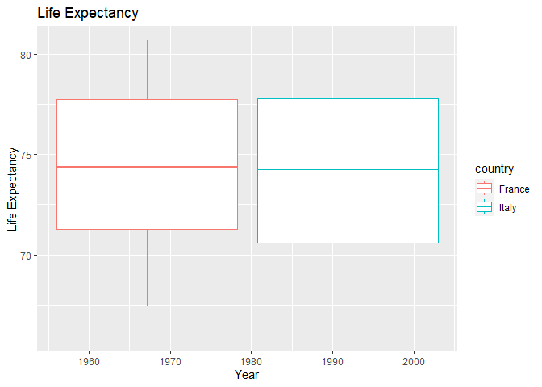

## Instructions
Answer the following questions and complete the exercises in RMarkdown. Please embed all of your code and push your final work to your repository. Your final lab report should be organized, clean, and run free from errors. Remember, you must remove the `#` for the included code chunks to run. Be sure to add your name to the author header above. For any included plots, make sure they are clearly labeled. You are free to use any plot type that you feel best communicates the results of your analysis.  

**In this homework, you should make use of the aesthetics you have learned. It's OK to be flashy!**

Make sure to use the formatting conventions of RMarkdown to make your report neat and clean!  

## Load the libraries

```r
library(tidyverse)
library(janitor)
library(here)
library(naniar)
```

## Resources
The idea for this assignment came from [Rebecca Barter's](http://www.rebeccabarter.com/blog/2017-11-17-ggplot2_tutorial/) ggplot tutorial so if you get stuck this is a good place to have a look.  

## Gapminder
For this assignment, we are going to use the dataset [gapminder](https://cran.r-project.org/web/packages/gapminder/index.html). Gapminder includes information about economics, population, and life expectancy from countries all over the world. You will need to install it before use. This is the same data that we will use for midterm 2 so this is good practice.

```r
#install.packages("gapminder")
library("gapminder")
```

## Questions
The questions below are open-ended and have many possible solutions. Your approach should, where appropriate, include numerical summaries and visuals. Be creative; assume you are building an analysis that you would ultimately present to an audience of stakeholders. Feel free to try out different `geoms` if they more clearly present your results.  

**1. Use the function(s) of your choice to get an idea of the overall structure of the data frame, including its dimensions, column names, variable classes, etc. As part of this, determine how NA's are treated in the data.**  

```r
glimpse(gapminder)
```

```
## Rows: 1,704
## Columns: 6
## $ country   <fct> "Afghanistan", "Afghanistan", "Afghanistan", "Afghanistan", …
## $ continent <fct> Asia, Asia, Asia, Asia, Asia, Asia, Asia, Asia, Asia, Asia, …
## $ year      <int> 1952, 1957, 1962, 1967, 1972, 1977, 1982, 1987, 1992, 1997, …
## $ lifeExp   <dbl> 28.801, 30.332, 31.997, 34.020, 36.088, 38.438, 39.854, 40.8…
## $ pop       <int> 8425333, 9240934, 10267083, 11537966, 13079460, 14880372, 12…
## $ gdpPercap <dbl> 779.4453, 820.8530, 853.1007, 836.1971, 739.9811, 786.1134, …
```

```r
anyNA(gapminder)
```

```
## [1] FALSE
```

```r
naniar::miss_var_summary(gapminder)
```

```
## # A tibble: 6 × 3
##   variable  n_miss pct_miss
##   <chr>      <int>    <dbl>
## 1 country        0        0
## 2 continent      0        0
## 3 year           0        0
## 4 lifeExp        0        0
## 5 pop            0        0
## 6 gdpPercap      0        0
```

```r
names(gapminder)
```

```
## [1] "country"   "continent" "year"      "lifeExp"   "pop"       "gdpPercap"
```

```r
tabyl(gapminder$country)
```

```
##         gapminder$country  n     percent
##               Afghanistan 12 0.007042254
##                   Albania 12 0.007042254
##                   Algeria 12 0.007042254
##                    Angola 12 0.007042254
##                 Argentina 12 0.007042254
##                 Australia 12 0.007042254
##                   Austria 12 0.007042254
##                   Bahrain 12 0.007042254
##                Bangladesh 12 0.007042254
##                   Belgium 12 0.007042254
##                     Benin 12 0.007042254
##                   Bolivia 12 0.007042254
##    Bosnia and Herzegovina 12 0.007042254
##                  Botswana 12 0.007042254
##                    Brazil 12 0.007042254
##                  Bulgaria 12 0.007042254
##              Burkina Faso 12 0.007042254
##                   Burundi 12 0.007042254
##                  Cambodia 12 0.007042254
##                  Cameroon 12 0.007042254
##                    Canada 12 0.007042254
##  Central African Republic 12 0.007042254
##                      Chad 12 0.007042254
##                     Chile 12 0.007042254
##                     China 12 0.007042254
##                  Colombia 12 0.007042254
##                   Comoros 12 0.007042254
##          Congo, Dem. Rep. 12 0.007042254
##               Congo, Rep. 12 0.007042254
##                Costa Rica 12 0.007042254
##             Cote d'Ivoire 12 0.007042254
##                   Croatia 12 0.007042254
##                      Cuba 12 0.007042254
##            Czech Republic 12 0.007042254
##                   Denmark 12 0.007042254
##                  Djibouti 12 0.007042254
##        Dominican Republic 12 0.007042254
##                   Ecuador 12 0.007042254
##                     Egypt 12 0.007042254
##               El Salvador 12 0.007042254
##         Equatorial Guinea 12 0.007042254
##                   Eritrea 12 0.007042254
##                  Ethiopia 12 0.007042254
##                   Finland 12 0.007042254
##                    France 12 0.007042254
##                     Gabon 12 0.007042254
##                    Gambia 12 0.007042254
##                   Germany 12 0.007042254
##                     Ghana 12 0.007042254
##                    Greece 12 0.007042254
##                 Guatemala 12 0.007042254
##                    Guinea 12 0.007042254
##             Guinea-Bissau 12 0.007042254
##                     Haiti 12 0.007042254
##                  Honduras 12 0.007042254
##          Hong Kong, China 12 0.007042254
##                   Hungary 12 0.007042254
##                   Iceland 12 0.007042254
##                     India 12 0.007042254
##                 Indonesia 12 0.007042254
##                      Iran 12 0.007042254
##                      Iraq 12 0.007042254
##                   Ireland 12 0.007042254
##                    Israel 12 0.007042254
##                     Italy 12 0.007042254
##                   Jamaica 12 0.007042254
##                     Japan 12 0.007042254
##                    Jordan 12 0.007042254
##                     Kenya 12 0.007042254
##          Korea, Dem. Rep. 12 0.007042254
##               Korea, Rep. 12 0.007042254
##                    Kuwait 12 0.007042254
##                   Lebanon 12 0.007042254
##                   Lesotho 12 0.007042254
##                   Liberia 12 0.007042254
##                     Libya 12 0.007042254
##                Madagascar 12 0.007042254
##                    Malawi 12 0.007042254
##                  Malaysia 12 0.007042254
##                      Mali 12 0.007042254
##                Mauritania 12 0.007042254
##                 Mauritius 12 0.007042254
##                    Mexico 12 0.007042254
##                  Mongolia 12 0.007042254
##                Montenegro 12 0.007042254
##                   Morocco 12 0.007042254
##                Mozambique 12 0.007042254
##                   Myanmar 12 0.007042254
##                   Namibia 12 0.007042254
##                     Nepal 12 0.007042254
##               Netherlands 12 0.007042254
##               New Zealand 12 0.007042254
##                 Nicaragua 12 0.007042254
##                     Niger 12 0.007042254
##                   Nigeria 12 0.007042254
##                    Norway 12 0.007042254
##                      Oman 12 0.007042254
##                  Pakistan 12 0.007042254
##                    Panama 12 0.007042254
##                  Paraguay 12 0.007042254
##                      Peru 12 0.007042254
##               Philippines 12 0.007042254
##                    Poland 12 0.007042254
##                  Portugal 12 0.007042254
##               Puerto Rico 12 0.007042254
##                   Reunion 12 0.007042254
##                   Romania 12 0.007042254
##                    Rwanda 12 0.007042254
##     Sao Tome and Principe 12 0.007042254
##              Saudi Arabia 12 0.007042254
##                   Senegal 12 0.007042254
##                    Serbia 12 0.007042254
##              Sierra Leone 12 0.007042254
##                 Singapore 12 0.007042254
##           Slovak Republic 12 0.007042254
##                  Slovenia 12 0.007042254
##                   Somalia 12 0.007042254
##              South Africa 12 0.007042254
##                     Spain 12 0.007042254
##                 Sri Lanka 12 0.007042254
##                     Sudan 12 0.007042254
##                 Swaziland 12 0.007042254
##                    Sweden 12 0.007042254
##               Switzerland 12 0.007042254
##                     Syria 12 0.007042254
##                    Taiwan 12 0.007042254
##                  Tanzania 12 0.007042254
##                  Thailand 12 0.007042254
##                      Togo 12 0.007042254
##       Trinidad and Tobago 12 0.007042254
##                   Tunisia 12 0.007042254
##                    Turkey 12 0.007042254
##                    Uganda 12 0.007042254
##            United Kingdom 12 0.007042254
##             United States 12 0.007042254
##                   Uruguay 12 0.007042254
##                 Venezuela 12 0.007042254
##                   Vietnam 12 0.007042254
##        West Bank and Gaza 12 0.007042254
##               Yemen, Rep. 12 0.007042254
##                    Zambia 12 0.007042254
##                  Zimbabwe 12 0.007042254
```

**2. Among the interesting variables in gapminder is life expectancy. How has global life expectancy changed between 1952 and 2007?**


```r
gapminder %>% 
  group_by(lifeExp) %>% 
  filter(year >= 1952 & year <= 2007) %>%
  ggplot(aes(x=lifeExp, y=year, fill=lifeExp, group=year))+geom_boxplot()+
    labs(x = "Life Expectancy", y = "Year", title = "Global life between 1952 and 2007")
```

```
## Warning: The following aesthetics were dropped during statistical transformation: fill
## ℹ This can happen when ggplot fails to infer the correct grouping structure in
##   the data.
## ℹ Did you forget to specify a `group` aesthetic or to convert a numerical
##   variable into a factor?
```

<!-- -->

**3. How do the distributions of life expectancy compare for the years 1952 and 2007?**

```r
gapminder %>% 
  group_by(lifeExp) %>% 
  filter(year =="1952" | year =="2007") %>%
  ggplot(aes(x=lifeExp, y=year, fill=lifeExp, group=year))+geom_boxplot()+
    labs(x = "Life Expectancy", y = "Year", title = "Global life 1952 and 2007")
```

```
## Warning: The following aesthetics were dropped during statistical transformation: fill
## ℹ This can happen when ggplot fails to infer the correct grouping structure in
##   the data.
## ℹ Did you forget to specify a `group` aesthetic or to convert a numerical
##   variable into a factor?
```

<!-- -->

**4. Your answer above doesn't tell the whole story since life expectancy varies by region. Make a summary that shows the min, mean, and max life expectancy by continent for all years represented in the data.**

```r
gapminder %>% 
  summarise(max_lifeExp=max(lifeExp),
            mean_lifeExp=mean(lifeExp),
            min_lifeExp=min(lifeExp))
```

```
## # A tibble: 1 × 3
##   max_lifeExp mean_lifeExp min_lifeExp
##         <dbl>        <dbl>       <dbl>
## 1        82.6         59.5        23.6
```

**5. How has life expectancy changed between 1952-2007 for each continent?**

```r
gapminder %>% 
  filter(year==1952 | year==2007) %>% 
  mutate(year=as.factor(year)) %>% 
  ggplot(aes(x=lifeExp, group=year, fill=year))+
  geom_density(alpha=0.5)+ 
     labs(x = "Contient", y = "Life Expectancy", title = "Contient Life Expectancy between 1952 and 2007")
```

<!-- -->

**6. We are interested in the relationship between per capita GDP and life expectancy; i.e. does having more money help you live longer?**


**7. Which countries have had the largest population growth since 1952?**

```r
gapminder %>% 
  select(country, year, pop) %>% 
  filter(year==1952 | year==2007) %>% 
  pivot_wider(names_from = year,
              values_from = pop) %>% 
  mutate(delta= 2007-1952) %>% 
  arrange(desc(delta))
```

```
## # A tibble: 142 × 4
##    country       `1952`    `2007` delta
##    <fct>          <int>     <int> <dbl>
##  1 Afghanistan  8425333  31889923    55
##  2 Albania      1282697   3600523    55
##  3 Algeria      9279525  33333216    55
##  4 Angola       4232095  12420476    55
##  5 Argentina   17876956  40301927    55
##  6 Australia    8691212  20434176    55
##  7 Austria      6927772   8199783    55
##  8 Bahrain       120447    708573    55
##  9 Bangladesh  46886859 150448339    55
## 10 Belgium      8730405  10392226    55
## # … with 132 more rows
```

**8. Use your results from the question above to plot population growth for the top five countries since 1952.**

```r
gapminder %>% 
  filter(country=="China" | country=="India" | country=="United States" | country=="Indonesia" | country=="Brazil") %>% 
  select(country, year, pop) %>% 
  ggplot(aes(x=year, y=pop, color=country))+
  geom_line()+
  scale_y_log10()
```

<!-- -->

```r
names(gapminder)
```

```
## [1] "country"   "continent" "year"      "lifeExp"   "pop"       "gdpPercap"
```

**9. How does per-capita GDP growth compare between these same five countries?**

```r
gapminder %>% 
  filter(country=="China" | country=="India" | country=="United States" | country=="Indonesia" | country=="Brazil") %>% 
  select(year, country, gdpPercap) %>% 
  ggplot(aes(x=year, y=gdpPercap, group=country, color=country))+
  geom_boxplot()+
  labs(title = "GDP growth between 5 countries",
       x="Year",
       y="GDP Growth")
```

<!-- -->

**10. Make one plot of your choice that uses faceting!**

```r
gapminder %>% 
  filter(country=="France" | country=="Italy") %>% 
  select(year, country, lifeExp) %>% 
  ggplot(aes(x=year, y=lifeExp, group=country, color=country))+
  geom_boxplot()+
  labs(title = "Life Expectancy ",
       x="Year",
       y="Life Expectancy")
```

<!-- -->

## Push your final code to GitHub!
Please be sure that you check the `keep md` file in the knit preferences. 
