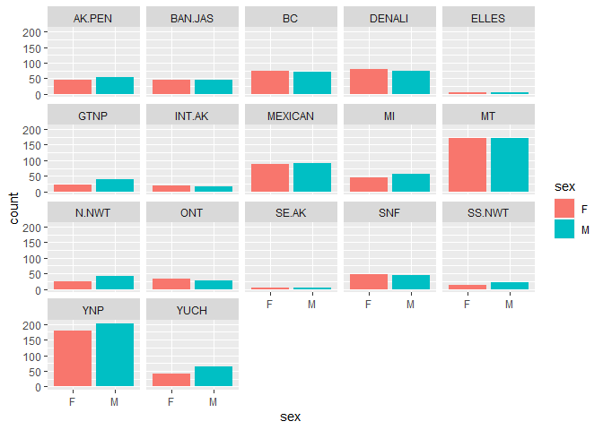

```r
library(tidyverse)
```

```
## ── Attaching packages ─────────────────────────────────────── tidyverse 1.3.2 ──
## ✔ ggplot2 3.4.0      ✔ purrr   1.0.0 
## ✔ tibble  3.1.8      ✔ dplyr   1.0.10
## ✔ tidyr   1.2.1      ✔ stringr 1.5.0 
## ✔ readr   2.1.3      ✔ forcats 0.5.2 
## ── Conflicts ────────────────────────────────────────── tidyverse_conflicts() ──
## ✖ dplyr::filter() masks stats::filter()
## ✖ dplyr::lag()    masks stats::lag()
```

```r
library(shiny)
library(shinydashboard)
```

```
## 
## Attaching package: 'shinydashboard'
## 
## The following object is masked from 'package:graphics':
## 
##     box
```

```r
require(janitor)
```

```
## Loading required package: janitor
## 
## Attaching package: 'janitor'
## 
## The following objects are masked from 'package:stats':
## 
##     chisq.test, fisher.test
```


1. Start by loading and exploring the data.

```r
wolves <- read_csv("data/wolves_data/wolves_dataset.csv")
```

```
## Rows: 1986 Columns: 23
## ── Column specification ────────────────────────────────────────────────────────
## Delimiter: ","
## chr  (4): pop, age.cat, sex, color
## dbl (19): year, lat, long, habitat, human, pop.density, pack.size, standard....
## 
## ℹ Use `spec()` to retrieve the full column specification for this data.
## ℹ Specify the column types or set `show_col_types = FALSE` to quiet this message.
```


```r
names(wolves)
```

```
##  [1] "pop"                "year"               "age.cat"           
##  [4] "sex"                "color"              "lat"               
##  [7] "long"               "habitat"            "human"             
## [10] "pop.density"        "pack.size"          "standard.habitat"  
## [13] "standard.human"     "standard.pop"       "standard.packsize" 
## [16] "standard.latitude"  "standard.longitude" "cav.binary"        
## [19] "cdv.binary"         "cpv.binary"         "chv.binary"        
## [22] "neo.binary"         "toxo.binary"
```

2. For the app, here is a faceted version of what we are looking for. We want the reactive part to be `pop` and you should use `shinydashboard`.

```r
wolves %>% 
  filter(sex!="NA") %>% 
  ggplot(aes(x=sex, fill=sex))+
  geom_bar()+
  facet_wrap(~pop)
```

<!-- -->


```r
ui <- 
  dashboardBody(
    fluidRow(
      box(title = "Plot Graphs",
        selectInput("x", "Select Wolf Population", choices = unique(wolves$pop))
      ),
        plotOutput("plot", width = "500px", height = "400px")
      ))
server <- function(input, output, session) { 
  output$plot <- renderPlot({
  ggplot(filter(wolves,pop==input$x & sex!="NA"), aes(x=sex, fill=sex)) +
      geom_bar() 
  })
  
  }
shinyApp(ui, server)
```

```{=html}
<div style="width: 100% ; height: 400px ; text-align: center; box-sizing: border-box; -moz-box-sizing: border-box; -webkit-box-sizing: border-box;" class="muted well">Shiny applications not supported in static R Markdown documents</div>
```


