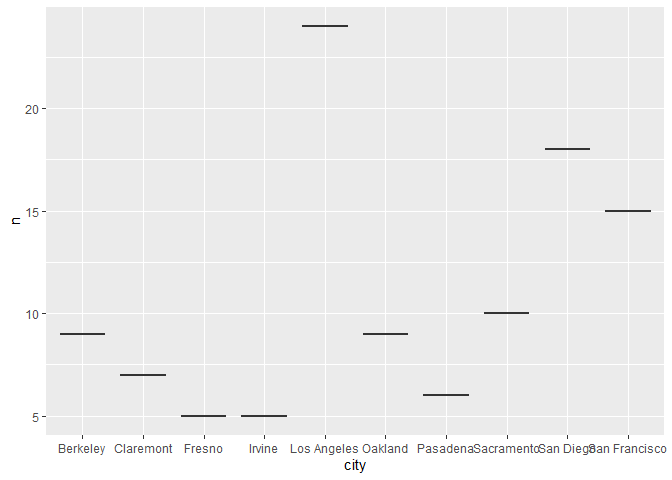
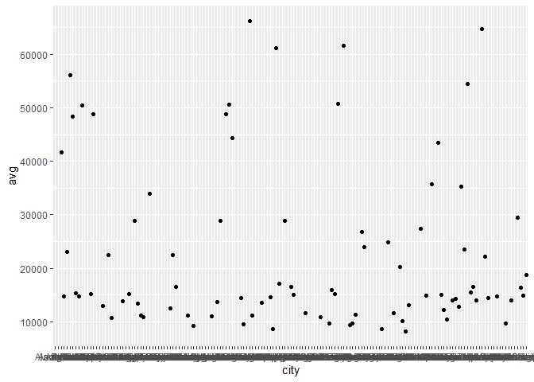
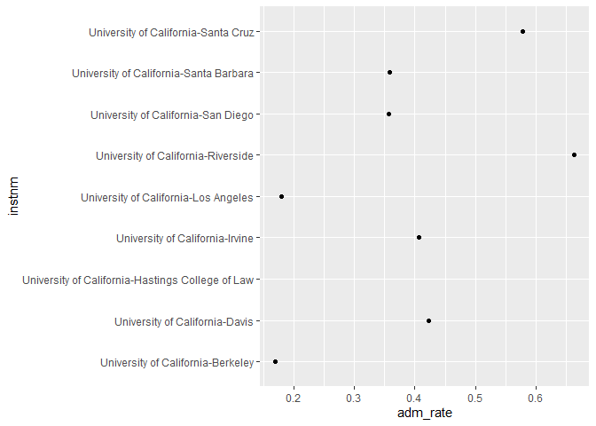
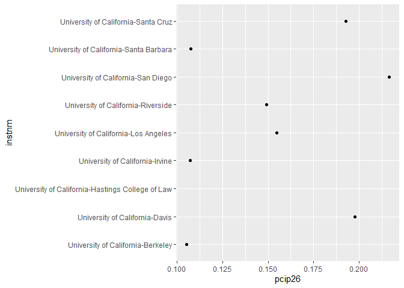

## Instructions
Answer the following questions and complete the exercises in RMarkdown. Please embed all of your code and push your final work to your repository. Your final lab report should be organized, clean, and run free from errors. Remember, you must remove the `#` for the included code chunks to run. Be sure to add your name to the author header above.  

Make sure to use the formatting conventions of RMarkdown to make your report neat and clean!  

## Load the libraries

```r
library(tidyverse)
library(janitor)
library(here)
library(naniar)
```

For this homework, we will take a departure from biological data and use data about California colleges. These data are a subset of the national college scorecard (https://collegescorecard.ed.gov/data/). Load the `ca_college_data.csv` as a new object called `colleges`.

```r
colleges <- read.csv(here("hw lab 9","data","ca_college_data.csv"))
```

The variables are a bit hard to decipher, here is a key:  

INSTNM: Institution name  
CITY: California city  
STABBR: Location state  
ZIP: Zip code  
ADM_RATE: Admission rate  
SAT_AVG: SAT average score  
PCIP26: Percentage of degrees awarded in Biological And Biomedical Sciences  
COSTT4_A: Annual cost of attendance  
C150_4_POOLED: 4-year completion rate  
PFTFTUG1_EF: Percentage of undergraduate students who are first-time, full-time degree/certificate-seeking undergraduate students  

1. Use your preferred function(s) to have a look at the data and get an idea of its structure. Make sure you summarize NA's and determine whether or not the data are tidy. You may also consider dealing with any naming issues.

```r
anyNA(colleges)
```

```
## [1] TRUE
```

```r
colleges %>% 
  summarize(number_nas = sum(is.na(colleges)))
```

```
##   number_nas
## 1        949
```


```r
glimpse(colleges)
```

```
## Rows: 341
## Columns: 10
## $ INSTNM        <chr> "Grossmont College", "College of the Sequoias", "College…
## $ CITY          <chr> "El Cajon", "Visalia", "San Mateo", "Ventura", "Oxnard",…
## $ STABBR        <chr> "CA", "CA", "CA", "CA", "CA", "CA", "CA", "CA", "CA", "C…
## $ ZIP           <chr> "92020-1799", "93277-2214", "94402-3784", "93003-3872", …
## $ ADM_RATE      <dbl> NA, NA, NA, NA, NA, NA, NA, NA, NA, NA, NA, NA, NA, NA, …
## $ SAT_AVG       <int> NA, NA, NA, NA, NA, NA, NA, NA, NA, NA, NA, NA, NA, NA, …
## $ PCIP26        <dbl> 0.0016, 0.0066, 0.0038, 0.0035, 0.0085, 0.0151, 0.0000, …
## $ COSTT4_A      <int> 7956, 8109, 8278, 8407, 8516, 8577, 8580, 9181, 9281, 93…
## $ C150_4_POOLED <dbl> NA, NA, NA, NA, NA, NA, 0.2334, NA, NA, NA, NA, 0.1704, …
## $ PFTFTUG1_EF   <dbl> 0.3546, 0.5413, 0.3567, 0.3824, 0.2753, 0.4286, 0.2307, …
```


```r
colleges_tidy<-janitor::clean_names(colleges)
```

2. Which cities in California have the highest number of colleges?

```r
colleges_california_cities <- colleges_tidy %>% 
  count(city) %>% 
  arrange(-n) %>% 
  slice_head(n=10)
colleges_california_cities
```

```
##             city  n
## 1    Los Angeles 24
## 2      San Diego 18
## 3  San Francisco 15
## 4     Sacramento 10
## 5       Berkeley  9
## 6        Oakland  9
## 7      Claremont  7
## 8       Pasadena  6
## 9         Fresno  5
## 10        Irvine  5
```

3. Based on your answer to #2, make a plot that shows the number of colleges in the top 10 cities.

```r
ggplot(colleges_california_cities, mapping=aes(x=city,y=n))+geom_boxplot()
```

<!-- -->

4. The column `COSTT4_A` is the annual cost of each institution. Which city has the highest average cost? Where is it located?

```r
colleges_cosstt4_a<-colleges_tidy %>% 
  group_by(city) %>% 
  summarise(avg=mean(costt4_a)) %>% 
  arrange(-avg)
colleges_cosstt4_a
```

```
## # A tibble: 161 × 2
##    city                  avg
##    <chr>               <dbl>
##  1 Malibu              66152
##  2 Valencia            64686
##  3 Redlands            61542
##  4 Moraga              61095
##  5 Atherton            56035
##  6 Thousand Oaks       54373
##  7 Rancho Palos Verdes 50758
##  8 La Verne            50603
##  9 Belmont             50415
## 10 La Mirada           48857
## # … with 151 more rows
```

5. Based on your answer to #4, make a plot that compares the cost of the individual colleges in the most expensive city. Bonus! Add UC Davis here to see how it compares :>).

```r
ggplot(colleges_cosstt4_a, mapping=aes(x=city,y=avg))+geom_point(na.rm = T)
```

<!-- -->

6. The column `ADM_RATE` is the admissions rate by college and `C150_4_POOLED` is the four-year completion rate. Use a scatterplot to show the relationship between these two variables. What do you think this means?

```r
colleges_tidy%>%
  ggplot(mapping =aes(x=adm_rate,y=c150_4_pooled))+geom_point(na.rm = T)
```

<!-- -->

7. Is there a relationship between cost and four-year completion rate? (You don't need to do the stats, just produce a plot). What do you think this means?

```r
colleges_tidy%>%
  ggplot(mapping =aes(x=costt4_a,y=c150_4_pooled))+geom_point(na.rm = T)
```

<!-- -->

```r
#The more money the student spends, the more likely they are to graduate in four years.
```

8. The column titled `INSTNM` is the institution name. We are only interested in the University of California colleges. Make a new data frame that is restricted to UC institutions. You can remove `Hastings College of Law` and `UC San Francisco` as we are only interested in undergraduate institutions.

```r
uc_only<-colleges_tidy %>% 
   filter(str_detect(instnm,"University of California"))
uc_only
```

```
##                                              instnm          city stabbr
## 1                University of California-San Diego      La Jolla     CA
## 2                   University of California-Irvine        Irvine     CA
## 3                University of California-Riverside     Riverside     CA
## 4              University of California-Los Angeles   Los Angeles     CA
## 5                    University of California-Davis         Davis     CA
## 6               University of California-Santa Cruz    Santa Cruz     CA
## 7                 University of California-Berkeley      Berkeley     CA
## 8            University of California-Santa Barbara Santa Barbara     CA
## 9  University of California-Hastings College of Law San Francisco     CA
## 10           University of California-San Francisco San Francisco     CA
##           zip adm_rate sat_avg pcip26 costt4_a c150_4_pooled pftftug1_ef
## 1       92093   0.3566    1324 0.2165    31043        0.8724      0.6622
## 2       92697   0.4065    1206 0.1073    31198        0.8764      0.7254
## 3       92521   0.6634    1078 0.1491    31494        0.7300      0.8111
## 4  90095-1405   0.1799    1334 0.1548    33078        0.9112      0.6607
## 5  95616-8678   0.4228    1218 0.1975    33904        0.8502      0.6049
## 6  95064-1011   0.5785    1201 0.1927    34608        0.7764      0.7856
## 7       94720   0.1693    1422 0.1053    34924        0.9165      0.7087
## 8       93106   0.3577    1281 0.1075    34998        0.8157      0.7077
## 9  94102-4978       NA      NA     NA       NA            NA          NA
## 10 94143-0244       NA      NA     NA       NA            NA          NA
```

Remove `Hastings College of Law` and `UC San Francisco` and store the final data frame as a new object `univ_calif_final`.

```r
univ_calif_final<-uc_only %>% 
  filter(instnm!="University of California-San Francisco")
univ_calif_final
```

```
##                                             instnm          city stabbr
## 1               University of California-San Diego      La Jolla     CA
## 2                  University of California-Irvine        Irvine     CA
## 3               University of California-Riverside     Riverside     CA
## 4             University of California-Los Angeles   Los Angeles     CA
## 5                   University of California-Davis         Davis     CA
## 6              University of California-Santa Cruz    Santa Cruz     CA
## 7                University of California-Berkeley      Berkeley     CA
## 8           University of California-Santa Barbara Santa Barbara     CA
## 9 University of California-Hastings College of Law San Francisco     CA
##          zip adm_rate sat_avg pcip26 costt4_a c150_4_pooled pftftug1_ef
## 1      92093   0.3566    1324 0.2165    31043        0.8724      0.6622
## 2      92697   0.4065    1206 0.1073    31198        0.8764      0.7254
## 3      92521   0.6634    1078 0.1491    31494        0.7300      0.8111
## 4 90095-1405   0.1799    1334 0.1548    33078        0.9112      0.6607
## 5 95616-8678   0.4228    1218 0.1975    33904        0.8502      0.6049
## 6 95064-1011   0.5785    1201 0.1927    34608        0.7764      0.7856
## 7      94720   0.1693    1422 0.1053    34924        0.9165      0.7087
## 8      93106   0.3577    1281 0.1075    34998        0.8157      0.7077
## 9 94102-4978       NA      NA     NA       NA            NA          NA
```

Use `separate()` to separate institution name into two new columns "UNIV" and "CAMPUS".

```r
 univ_calif_final %>% 
  separate(instnm,into = c("univ","campus"),sep = "-")
```

```
##                       univ                  campus          city stabbr
## 1 University of California               San Diego      La Jolla     CA
## 2 University of California                  Irvine        Irvine     CA
## 3 University of California               Riverside     Riverside     CA
## 4 University of California             Los Angeles   Los Angeles     CA
## 5 University of California                   Davis         Davis     CA
## 6 University of California              Santa Cruz    Santa Cruz     CA
## 7 University of California                Berkeley      Berkeley     CA
## 8 University of California           Santa Barbara Santa Barbara     CA
## 9 University of California Hastings College of Law San Francisco     CA
##          zip adm_rate sat_avg pcip26 costt4_a c150_4_pooled pftftug1_ef
## 1      92093   0.3566    1324 0.2165    31043        0.8724      0.6622
## 2      92697   0.4065    1206 0.1073    31198        0.8764      0.7254
## 3      92521   0.6634    1078 0.1491    31494        0.7300      0.8111
## 4 90095-1405   0.1799    1334 0.1548    33078        0.9112      0.6607
## 5 95616-8678   0.4228    1218 0.1975    33904        0.8502      0.6049
## 6 95064-1011   0.5785    1201 0.1927    34608        0.7764      0.7856
## 7      94720   0.1693    1422 0.1053    34924        0.9165      0.7087
## 8      93106   0.3577    1281 0.1075    34998        0.8157      0.7077
## 9 94102-4978       NA      NA     NA       NA            NA          NA
```

9. The column `ADM_RATE` is the admissions rate by campus. Which UC has the lowest and highest admissions rates? Produce a numerical summary and an appropriate plot.

```r
univ_calif_final %>% 
  select("instnm","adm_rate") %>% 
  arrange(desc(adm_rate))
```

```
##                                             instnm adm_rate
## 1               University of California-Riverside   0.6634
## 2              University of California-Santa Cruz   0.5785
## 3                   University of California-Davis   0.4228
## 4                  University of California-Irvine   0.4065
## 5           University of California-Santa Barbara   0.3577
## 6               University of California-San Diego   0.3566
## 7             University of California-Los Angeles   0.1799
## 8                University of California-Berkeley   0.1693
## 9 University of California-Hastings College of Law       NA
```


```r
univ_calif_final%>%
  ggplot(mapping =aes(x=adm_rate,y=instnm))+geom_point(na.rm = T)
```

<!-- -->

10. If you wanted to get a degree in biological or biomedical sciences, which campus confers the majority of these degrees? Produce a numerical summary and an appropriate plot.

```r
univ_calif_final %>% 
  select("instnm","pcip26") %>% 
  arrange(desc(pcip26))
```

```
##                                             instnm pcip26
## 1               University of California-San Diego 0.2165
## 2                   University of California-Davis 0.1975
## 3              University of California-Santa Cruz 0.1927
## 4             University of California-Los Angeles 0.1548
## 5               University of California-Riverside 0.1491
## 6           University of California-Santa Barbara 0.1075
## 7                  University of California-Irvine 0.1073
## 8                University of California-Berkeley 0.1053
## 9 University of California-Hastings College of Law     NA
```


```r
univ_calif_final%>%
  ggplot(mapping =aes(x=pcip26,y=instnm))+geom_point(na.rm = T)
```

<!-- -->

## Knit Your Output and Post to [GitHub](https://github.com/FRS417-DataScienceBiologists)
